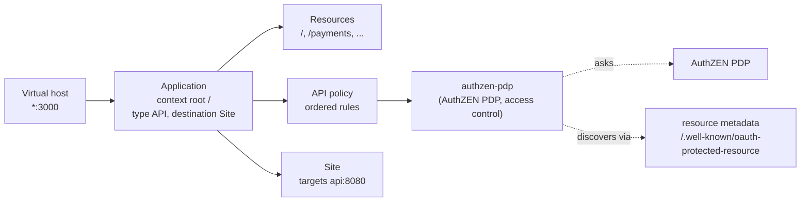
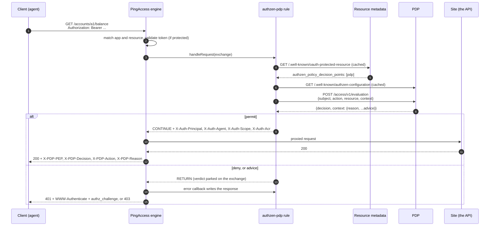

# PingAccess as an AuthZEN enforcement point

PingAccess already decides who gets through: it validates the token, matches the
application and resource, runs the policy, and proxies to the site. What it does not
have is a way to ask an external Policy Decision Point a question shaped like *this
agent, acting for this person, wants to do this to this resource, now*, and to turn the
answer into something a client can act on. The `authzen-pdp` rule adds that. It is an
Add-on SDK rule, one jar in `deploy/`, and once it is on an application's policy every
request through that application is an OpenID AuthZEN 1.0 evaluation against the PDP
that decides for that resource.

This page is for two readers who arrive from opposite sides: the PingAccess
administrator who knows applications and rules but not AuthZEN, and the person who has
read [architecture.md](architecture.md) and wants to know where PingAccess's own
machinery ends and the rule begins. The [README](../gateways/pingaccess/README.md) next
to the code is the reference card: every knob, the build, the tests. This is the
explainer.

## Two vocabularies

| AuthZEN says | PingAccess has | Here |
| --- | --- | --- |
| Policy Enforcement Point (PEP) | the engine, a rule on a policy | PingAccess running the `authzen-pdp` rule |
| Policy Decision Point (PDP) | nothing built in; the PingAuthorize rules speak a proprietary API | any AuthZEN 1.0 PDP, found per resource |
| subject, action, resource, context | the OAuth identity, the request | built by the rule from the token and the request |
| decision, with advice in `context` | Outcome: continue or return | permit, or a deny rendered as a challenge |
| protected resource (RFC 8707 identifier) | an application and its resources | the `resource` knob, the key discovery starts from |
| access token | Access Validation on the application | validated by PingAccess when the application is protected; read by the rule either way |

## Where the rule sits

PingAccess's objects, and where the rule attaches:



A request arrives on a virtual host, matches an application by context root and a
resource within it by path, and then PingAccess does its own work before any rule runs:

1. **Access Validation.** For an API application this is *Unprotected*, *Remote* (the
   token provider introspects the bearer token) or a named access token validator (a
   local check of a signed or encrypted JWT). Protected means the token is verified,
   with its expiry and audience, before the policy is consulted. Unprotected means no
   token is looked at, and the request reaches the policy as it came.
2. **Identity mappings**, so that rules see the identity PingAccess established.
3. **Access control rules**, in the order they sit on the policy: application rules,
   then the resource's own. `authzen-pdp` is an access control rule, so it runs here.
4. **Processing rules** (header and URL rewrites), site authentication, and the proxy
   to the site. Or, for an Agent destination, the verdict and headers back to the
   agent.

Two things follow from that order. The rule sees a token PingAccess has already
validated when the application is protected, which is the posture to run in
production. And because the rule is access control, put it near the top of the policy:
a deny costs nothing further, and the rules after it only run on a permit.

## One request, end to end



What the rule does with each request, in order. It is the Kong plugin's `access()`
phase, ported line for line, so the two send a PDP the same evaluation and answer a
client the same way:

1. **The well-known relay.** If the route is the resource's federation face
   (`federation_entity_url`), the two well-known documents are relayed from `coaz-pep`
   before any token is looked at. They are public by definition.
2. **The user.** With `require_user_login`, no valid `X-User-Token` is a login challenge.
3. **The token.** `Authorization: Bearer` or `DPoP`. With `require_token`, none is a 401.
   The claims come from the token's payload overlaid with what PingAccess established
   (below). No readable subject is a 401.
4. **DPoP**, when required, is verified by `coaz-pep`, which checks the proof's signature,
   freshness, replay and binding. Anything that cannot be verified is denied.
5. **COAZ.** On an `mcp` route with `coaz_url`, a `tools/call` goes to the engine, which
   discovers the tool's mapping, evaluates it, asks the PDP and returns either a permit
   or a JSON-RPC error to relay verbatim. Other MCP traffic passes on a valid token.
6. **The mapping.** The request becomes an action, a resource and a context: a balance
   read is `get_balance` on `account a1`; a payment carries the amount and currency. The
   subject is the agent (`act.sub`, or the client), acting for the person (`sub`).
7. **Discovery.** Which PDPs decide for this resource, and where they evaluate. The
   resource's metadata rides along in the context, verbatim.
8. **The layers.** Each PDP is asked in order. Every one must permit; the first deny is
   the answer. An unreachable PDP is a 503 unless that layer was told to fail open.
9. **The answer.** A permit continues with the `X-Auth-*` headers on the request. Advice
   in the decision becomes a challenge; a plain deny is a 403 with the policy's reason.

## What PingAccess validates, and what the rule reads

**The access token is PingAccess's.** When the application is protected, the engine has
verified the token before the rule sees it, and hands the rule an `Identity`: the
validated attributes, the subject, the client and scopes. The rule reads those first.
It also decodes the token's own payload when the token is a JWT, because PingAccess does
not surface every claim the policy wants (`act`, `cnf`, `acr`), and lets PingAccess's
view win wherever the two overlap. An opaque token validated by introspection works the
same way: the identity is all there is, and it is enough.

When the application is **Unprotected**, there is only the payload, decoded and not
verified. The demo runs that way because its tokens are unsigned, and the rule logs
nothing special about it; the authorization decision is still the PDP's, but the claims
it is given are the client's word. That is the Kong plugin's posture too, and the reason
production wants a protected application.

**DPoP is PingAccess's when it validates the token.** The application's DPoP settings
enforce RFC 9449 natively, and that is where it belongs. `require_dpop` on the rule is
for the unprotected case and for parity with Kong: the proof goes to `coaz-pep`, and
the rule refuses the configuration outright if there is no `coaz_url` to send it to. It
cannot verify a proof itself with any honesty; a thumbprint comparison proves nothing
when the proof carries the very JWK being compared.

**`X-User-Token` is the rule's.** It is the one token PingAccess has no native way to
validate, and the one whose claims feed the login gate and the step-up decision, which
is exactly what a forged one would walk through. With `user_token_jwks_url` set the rule
verifies it (signature, `exp`, `nbf`, `iss`, `aud`, `alg: none` refused) and a token that
fails yields no claims at all, so those gates close rather than open. Unset, it is
decoded only, and the rule says so in the log each time it is configured.

## Finding the PDP

The rule is never told which PDP decides; it can be, and the static `authzen_url` is
always the fallback, but the point of the repository is that it need not be. Three
modes:

| `pdp_discovery` | What the rule reads | Then |
| --- | --- | --- |
| `off` | nothing | posts to `authzen_url` at AuthZEN's default paths |
| `authzen` | `authzen_url`'s `/.well-known/authzen-configuration` | posts where that document says |
| `resource` | the resource's `/.well-known/oauth-protected-resource` (RFC 9728), whose `authzen_policy_decision_points` names the PDP; then that PDP's metadata | posts to the PDP the resource named, or `authzen_url` when it names none |

There is no federation mode in the rule. Resolving an OpenID Federation Trust Chain
means verifying Entity Statements against configured anchors, and that lives in
`coaz-pep` alone so it cannot drift. A route that must take the federation's word over
the resource's own belongs behind `coaz-pep`; the rule can still be that resource's
federation face by relaying the documents `coaz-pep` signs.

Whatever document named the PDP is forwarded to it verbatim as
`context.resource_metadata`, tagged with where it came from, alongside the endpoint hit
and, when the route allows, the raw token. The rule reads none of it. What a resource
requires (its scopes, the acr it expects) is the PDP's to enforce, and the PDP can say
what would satisfy it, which is how a deny stays resolvable. The reasons are laid out in
[architecture.md](architecture.md#what-the-pep-forwards-and-what-it-does-not-decide).

`pdp_layers` is the ordered list of PDPs every request asks: `static`, `resource`, or an
explicit PDP identifier, each optionally ` fail-open` or ` fail-closed`. It is how an
estate-wide PDP that judges the token and the client sits in front of the resource's
own. Across permitting layers the obligations accumulate, so a generic PDP's "permit,
but step up" survives the resource PDP's plain permit. A permit that skipped a
fail-open layer says so in `X-PDP-Fail-Open`.

Three rules never relax: a URL outside an allowlist fails closed rather than falling to
a weaker source; a discovered PDP never receives `authzen_api_key`; and metadata is
cached per identifier with stale-while-failing, so a metadata outage is not an
authorization outage.

## The deny, on the wire

The deny is the interesting part. A flat 403 tells an agent nothing it can act on, so
when the policy says how a deny could be resolved, the rule renders that as the same
challenge every other PEP in this repository renders. These are real responses from the
demo, headers trimmed to the ones that matter.

A payment over the policy's threshold, which the user has not approved: RFC 9470 step-up.

```http
HTTP/1.1 401 Unauthorized
WWW-Authenticate: Bearer error="insufficient_scope", scope="payments:approve"
Content-Type: application/json
X-PDP-PEP: PingAccess (resource discovery)
X-PDP-Decision: DENY
X-PDP-Action: make_payment
X-PDP-Reason: payments over 1000 need the customer's approval

{"error":"insufficient_scope","scope":"payments:approve","pep":"PingAccess (resource discovery)",
 "reason":"payments over 1000 need the customer's approval",
 "authz_challenge":{"type":"resource_authorisation","scope":"payments:approve",
                    "reason":"payments over 1000 need the customer's approval","pep":"PingAccess (resource discovery)"}}
```

A customer with no verified identity yet: present a credential, then retry.

```http
HTTP/1.1 401 Unauthorized
WWW-Authenticate: Bearer error="identity_verification_required", doctype="org.iso.18013.5.1.mDL"

{"error":"identity_verification_required","doctype":"org.iso.18013.5.1.mDL", ...,
 "authz_challenge":{"type":"identity_proofing","doctype":"org.iso.18013.5.1.mDL", ...}}
```

No authenticated user behind the agent (`require_user_login`): log in.

```http
HTTP/1.1 401 Unauthorized
WWW-Authenticate: Bearer error="insufficient_user_authentication", error_description="Login required", acr_values="urn:pingidentity:loa:password"

{"error":"login_required","pep":"...","reason":"The gateway requires an authenticated user (no valid X-User-Token).","acr_values":"urn:pingidentity:loa:password"}
```

Everything else is `{"error":"authorization_failed","pep":...,"reason":...}`: 401 with no
token or no readable subject, 403 when the policy simply says no, 503 when the PDP or
the discovery it depends on cannot be reached. On an MCP route, a denied `tools/call` is
the engine's JSON-RPC error relayed untouched, HTTP 200 and all, because that is what
the COAZ profile requires and two renderings of one decision would drift.

A permit carries the delegation chain to the site, `X-Auth-Principal`, `X-Auth-Agent`,
`X-Auth-Scope` and `X-Auth-Acr`, so the API can record who acted for whom and under what
authentication context, rather than inferring a channel from a username. The `X-PDP-*`
response headers are the demo transcript's; they are harmless in production and useful
in a support ticket.

**How that is written, for anyone porting another rule.** PingAccess's contract for a
rule is that `Outcome.RETURN` means *this rule rejects the request; call its error
handling callback for the response*. That is how its own Redirect and PingAuthorize
rules work. Setting a response yourself and returning `RETURN` gets you the callback's
output, not yours. So the rule parks its verdict on the exchange and the callback
renders it: status, `WWW-Authenticate`, the JSON body, the `X-PDP-*` headers. On a
permit the request headers go on in `handleRequest` and the response headers in
`handleResponse`. In an Agent deployment the response never passes through PingAccess,
so the `X-Auth-*` headers reach the agent as with any rule and the `X-PDP-*` ones do not.

## Wiring it up

In the console: **Access > Rules**, add a rule of type **AuthZEN PDP**; every field of
that form is documented in [pingaccess-console.md](pingaccess-console.md). Then on the
application, **Applications > Applications**, edit, the **API Policy** tab, and drag the
rule from **Available Rules** onto the policy bar; drag it up so it runs early. A
resource can carry its own policy, which runs after the application's.

The same over the admin API, which is what
[the demo's hook](../demo/pingaccess/hooks/81-after-start-process.sh) does at boot: a
site, a rule, an application, in that order, each one call. The rule's `configuration`
is the same map of knobs every PEP in this repository takes, spelled identically, so a
route in Kong and a policy in PingAccess read the same. Three worked configurations.

**A REST API behind a protected application, discovering its PDP.** PingAccess
validates the token (Access Validation: a JWT validator against the AS's JWKS, or Remote
for introspection); the rule finds the PDP from the API's own metadata.

```json
{
  "name": "bank-api",
  "className": "com.idpartners.pa.authzen.AuthZenRule",
  "supportedDestinations": ["Site", "Agent"],
  "configuration": {
    "authzen_url": "https://pdp.bank.example",
    "authzen_api_key": "...",
    "pep_label": "PEP#2 (Bank API edge)",
    "style": "rest",
    "require_token": true,
    "pdp_discovery": "resource",
    "resource": "https://api.bank.example",
    "resource_metadata_allowlist": ["https://api.bank.example"],
    "pdp_allowlist": ["https://pdp.bank.example"],
    "forward_access_token": true,
    "user_token_jwks_url": "https://as.bank.example/jwks",
    "user_token_issuer": "https://as.bank.example"
  }
}
```

**An MCP edge.** The rule authorises access to the MCP service on the `initialize`
handshake and hands every `tools/call` to `coaz-pep`, which does the per-tool mapping;
the resource identifier defaults to the MCP upstream.

```json
{
  "configuration": {
    "authzen_url": "https://pdp.bank.example",
    "authzen_api_key": "...",
    "pep_label": "PEP#1 (MCP edge)",
    "style": "mcp",
    "require_token": true,
    "require_user_login": true,
    "coaz_url": "https://coaz-pep.internal:9192",
    "coaz_api_key": "...",
    "mcp_upstream_url": "https://bank-mcp.internal/mcp",
    "pdp_discovery": "resource"
  }
}
```

**An estate PDP in front.** Every request asks the estate's PDP first (is this client in
good standing, is this token sender-constrained), then the resource's own. The estate
layer is advice worth having and not worth an outage, so it fails open; the resource's
does not.

```json
{
  "configuration": {
    "authzen_url": "https://pdp.bank.example",
    "pdp_discovery": "resource",
    "resource": "https://api.bank.example",
    "pdp_allowlist": ["https://pdp.bank.example", "https://estate-pdp.example"],
    "pdp_layers": ["https://estate-pdp.example fail-open", "resource"],
    "fail_mode": "closed"
  }
}
```

Then the application, with the rule as its API policy:

```json
{
  "name": "bank", "contextRoot": "/", "applicationType": "API", "defaultAuthType": "API",
  "destination": "Site", "siteId": 1, "virtualHostIds": [2],
  "accessValidatorId": 3,
  "enabled": true,
  "policy": {"API": [{"type": "Rule", "id": 1}]}
}
```

`accessValidatorId` is the access token validator's id, `1` for Remote, `0` for
Unprotected. Send `"enabled": true`: the API creates applications disabled, and a
disabled application answers every request with PingAccess's own HTML 403 before any
rule runs, which is easy to mistake for the rule denying.

## Running it

**Build** against the Add-on SDK, which is on no Maven repository: take
`lib/pingaccess-sdk-<version>.jar` from an install or from the public Docker image,
then `mvn verify`. The README has the commands. Nothing from the SDK, Jackson, jose4j
or slf4j is bundled; PingAccess supplies them all. The bytecode is Java 17, so the jar
loads on PingAccess 8.x and 9.x alike.

**Install** by copying the jar to `<PA_HOME>/deploy/` and restarting; PingAccess reads
that directory at start and nothing hot-loads. With the DevOps image, the local server
profile is `/opt/in/instance/`, merged into the instance at boot, so the jar goes in
`/opt/in/instance/deploy/`, whether that is baked into an image as the demo does,
mounted, or delivered by `SERVER_PROFILE_URL`. In a cluster the jar is needed on every
engine and on the admin node, which validates the configuration.

**Check** it arrived: `GET /pa-admin-api/v3/rules/descriptors` lists
`AuthZenPdpRule` with every knob, and the console offers *AuthZEN PDP* as a rule type.

**Threads.** Every decision runs on the rule's own bounded pool of daemon workers, so a
slow PDP never holds one of the engine's I/O threads. Saturation is a 503 deny rather
than a queue that grows without end; `-Dauthzen.pdp.threads=N` in the JVM options sets
the size, 64 by default.

**Logs** go to `pingaccess.log` under the logger `com.idpartners.pa.authzen`: a warning
per rule instance at configure time when `pdp_ssl_verify` is off or `X-User-Token` is
unverified, an error line for every deny the rule made on its own account (PDP or
engine unreachable, discovery refused, verification failed), and a warning for every
layer that failed open. The PDP's reason for a deny is in the response, not the log.

## Production posture

- A **protected application**: a JWT validator or Remote validation, so the token the
  rule reads has been verified by PingAccess. Unprotected is for demos with unsigned
  tokens and nothing else.
- **DPoP on the application** when the AS issues sender-constrained tokens; `require_dpop`
  only when the application is unprotected and `coaz-pep` is reachable.
- **`user_token_jwks_url`** wherever `require_user_login` or a step-up decision depends
  on `X-User-Token`.
- **Allowlists set**: `resource_metadata_allowlist` to the resources this route fronts,
  `pdp_allowlist` to the PDPs a resource may name. Empty means any, which is a warning
  in `coaz-pep` and should be read as one here.
- **`pdp_ssl_verify` on.** Off is process-wide for JDK HTTP clients built afterwards and
  exists for local development only.
- **`forward_access_token`** only to a PDP reached over TLS with a key on it: it puts a
  bearer token on the wire.
- **`coaz_api_key`** set, and `CHECK_API_TOKEN` on the `coaz-pep` it points at: that
  endpoint fetches a caller-supplied URL with a caller-supplied header.
- **`fail_mode` closed** unless a layer has earned otherwise. A PEP that fails open is
  not a PEP; a layer that fails open is a choice, made per layer, and marked on every
  permit it affects.

## Troubleshooting

| What you see | What it is | What to do |
| --- | --- | --- |
| *AuthZEN PDP* is not offered as a rule type; no `AuthZenPdpRule` in `/rules/descriptors` | the jar is not in `deploy/`, or PingAccess was not restarted after it was | copy it, restart, check `pingaccess.log` for a classloading error |
| every request gets an HTML **403 Forbidden** page | the application is disabled, or no resource matched | `"enabled": true`; check the context root and virtual host |
| **401** `authorization_failed` "No access token presented" | the request had no `Authorization` header, or PingAccess consumed it | on a protected application the token still reaches the rule; check the client |
| **401** "no subject claim" | an opaque token on an unprotected application, or a JWT without `sub` | protect the application so introspection yields a subject, or fix the token |
| **503** "could not be resolved" | discovery refused: a resource or PDP outside an allowlist, an invalid chain, or a resource with no usable metadata and no static PDP | the log names the URL and the rule it broke; widen the allowlist deliberately or fix the metadata |
| **503** "unreachable" | the PDP (or `coaz-pep`) did not answer, or answered with an error | network, TLS trust, the key; nothing fails open unless told to |
| **500** "The authorization rule failed" | the rule threw, or PingAccess failed it; fail-closed | the stack trace is in `pingaccess.log` |
| a step-up loops | the client retries with the same token; the step-up scope must be obtained from the AS first | the challenge names the scope; get it, then retry |
| `X-User-Token` never counts as logged in | verification is on and the token fails it: wrong issuer or audience, expired, unknown `kid`, or `alg: none` | the log says which; the demo's unsigned tokens cannot pass a JWKS |
| the site sees no `X-Auth-*` headers | the request was denied before they were set, or a processing rule after this one stripped them | check `X-PDP-Decision`; look at the processing rules on the policy |
| responses carry no `X-PDP-*` headers | Agent destination, where the response does not pass through PingAccess | expected; the request headers still arrive |

## What it deliberately does not do

- **Resolve a federation.** That is `coaz-pep`'s, and only `coaz-pep`'s, so the Trust
  Chain rules cannot drift. The rule relays the documents for a resource whose face it is.
- **Evaluate COAZ mappings.** The CEL that maps a tool call's arguments into an AuthZEN
  request is compiled and evaluated in one place. The rule hands `tools/call` over.
- **Validate the access token.** PingAccess does, on a protected application, with its
  own validators and providers; a second implementation would be a second opinion.
- **Web sessions.** It is an API rule. On a Web+API application it runs on the API side.
- **Replace the PingAuthorize rules.** PingAccess ships *PingAuthorize Policy Decision
  Access Control* and *PingAuthorize Access Control*, which speak PingAuthorize's own
  sideband and policy-decision APIs to PingAuthorize alone. This rule speaks AuthZEN 1.0
  to any conformant PDP, PingAuthorize behind its AuthZEN adapter included, discovers
  which PDP decides, and returns challenges a client can resolve. The two can coexist on
  one PingAccess; they answer different questions.

## Standards

AuthZEN Authorization API 1.0 · OpenID AuthZEN MCP profile (COAZ), via `coaz-pep` · RFC
9728 OAuth 2.0 Protected Resource Metadata · RFC 9449 DPoP · RFC 9470 step-up · RFC 8693
token exchange (`act`) · RFC 8707 resource indicators · the PingAccess Add-on SDK for
Java, `AsyncRuleInterceptor`.
